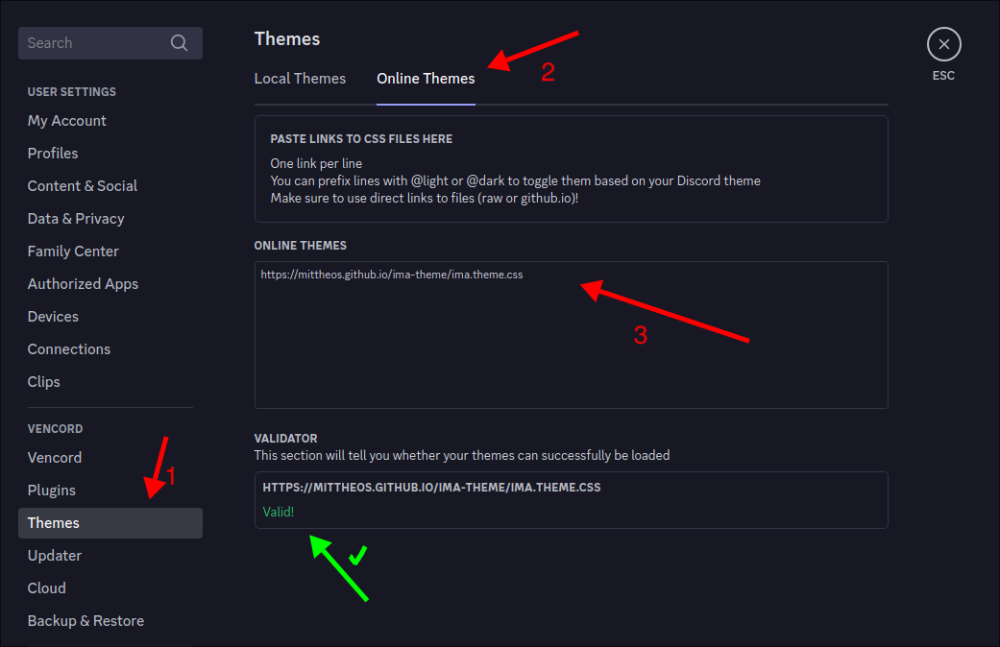

# Ima Theme
This is a discord theme designed with the color palett from [Catppuccin](https://catppuccin.com/palette) Mocha

## Install with Vencord
#### Install Vencord
Download & install [vencord](https://vencord.dev/download/) for your platform

#### Add the theme to Vencord
To install this theme simply copy and paste this URL into the settings/Themes/Online Themes box
```
https://mittheos.github.io/ima-theme/ima.theme.css
```

